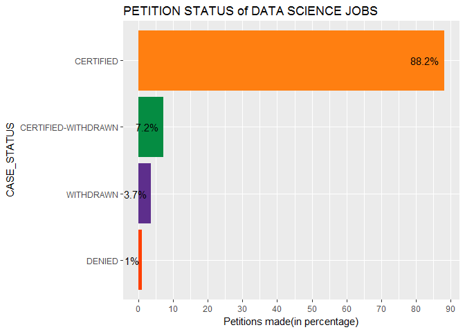
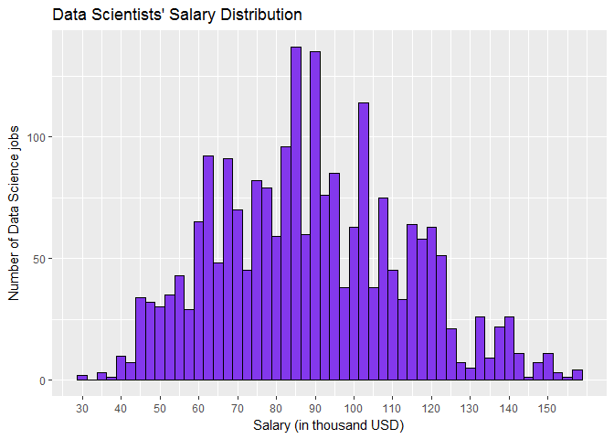
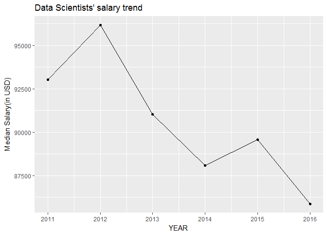
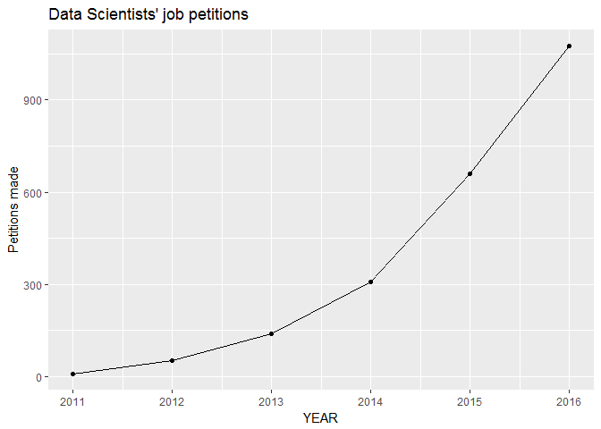
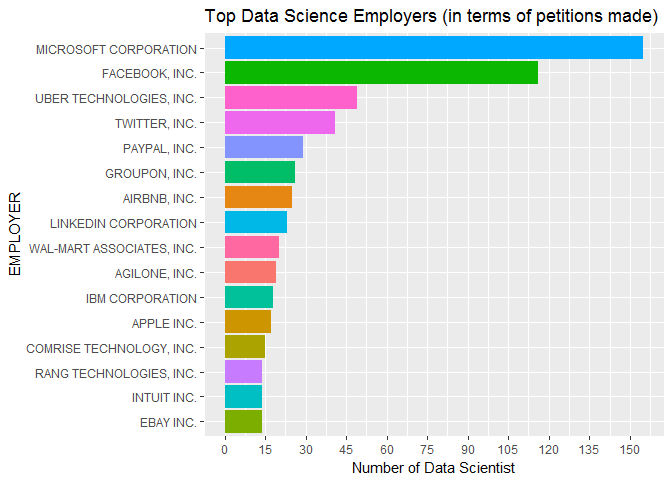
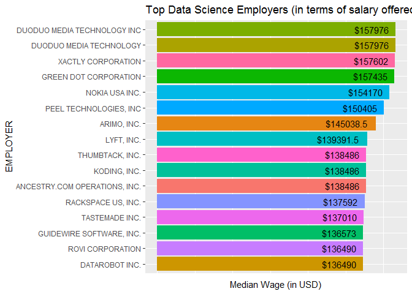
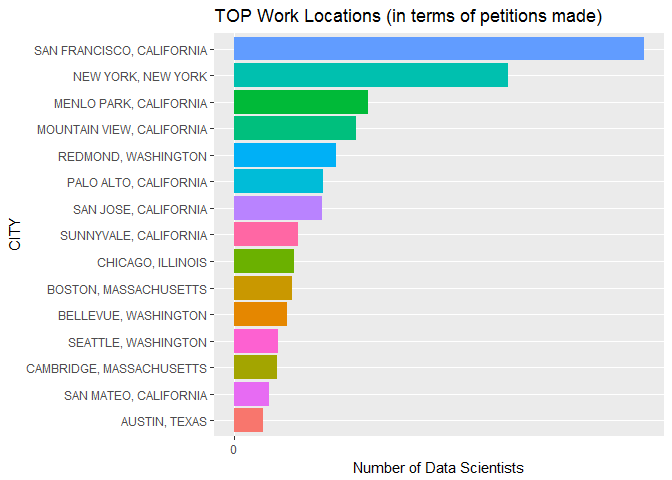
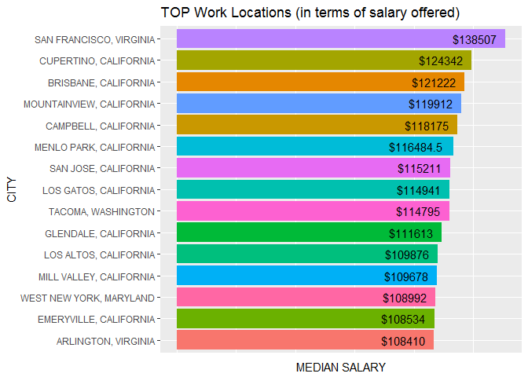
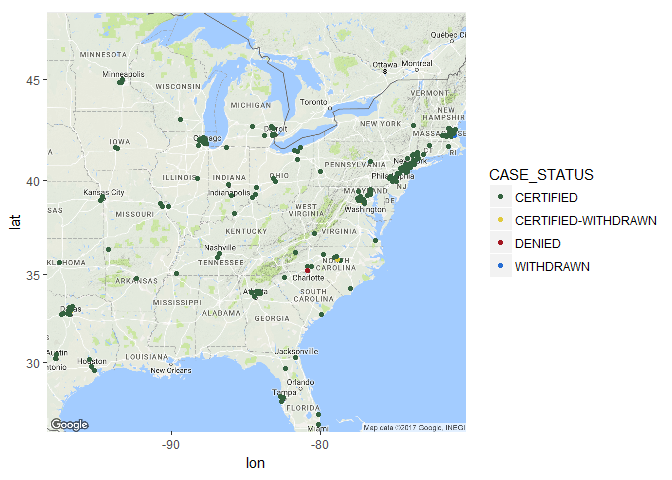
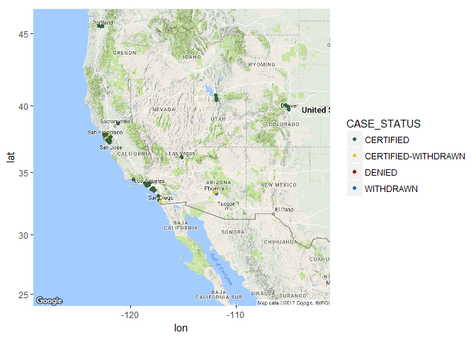

Analysis of Data Science jobs from H1B Visa Petitions Data
================

### We'll start by loading the necessary libraries.

    ## 
    ## Attaching package: 'dplyr'

    ## The following object is masked from 'package:gridExtra':
    ## 
    ##     combine

    ## The following objects are masked from 'package:stats':
    ## 
    ##     filter, lag

    ## The following objects are masked from 'package:base':
    ## 
    ##     intersect, setdiff, setequal, union

### Get input.

``` r
visa <- read_csv("h1b_kaggle.csv")
```

    ## Parsed with column specification:
    ## cols(
    ##   X1 = col_integer(),
    ##   CASE_STATUS = col_character(),
    ##   EMPLOYER_NAME = col_character(),
    ##   SOC_NAME = col_character(),
    ##   JOB_TITLE = col_character(),
    ##   FULL_TIME_POSITION = col_character(),
    ##   PREVAILING_WAGE = col_double(),
    ##   YEAR = col_integer(),
    ##   WORKSITE = col_character(),
    ##   lon = col_double(),
    ##   lat = col_double()
    ## )

``` r
visa <- data.frame(visa)
```

### Let us look at the structure and summary of the data.

``` r
str(visa)
```

    ## 'data.frame':    3002458 obs. of  11 variables:
    ##  $ X1                : int  1 2 3 4 5 6 7 8 9 10 ...
    ##  $ CASE_STATUS       : chr  "CERTIFIED-WITHDRAWN" "CERTIFIED-WITHDRAWN" "CERTIFIED-WITHDRAWN" "CERTIFIED-WITHDRAWN" ...
    ##  $ EMPLOYER_NAME     : chr  "UNIVERSITY OF MICHIGAN" "GOODMAN NETWORKS, INC." "PORTS AMERICA GROUP, INC." "GATES CORPORATION, A WHOLLY-OWNED SUBSIDIARY OF TOMKINS PLC" ...
    ##  $ SOC_NAME          : chr  "BIOCHEMISTS AND BIOPHYSICISTS" "CHIEF EXECUTIVES" "CHIEF EXECUTIVES" "CHIEF EXECUTIVES" ...
    ##  $ JOB_TITLE         : chr  "POSTDOCTORAL RESEARCH FELLOW" "CHIEF OPERATING OFFICER" "CHIEF PROCESS OFFICER" "REGIONAL PRESIDEN, AMERICAS" ...
    ##  $ FULL_TIME_POSITION: chr  "N" "Y" "Y" "Y" ...
    ##  $ PREVAILING_WAGE   : num  36067 242674 193066 220314 157518 ...
    ##  $ YEAR              : int  2016 2016 2016 2016 2016 2016 2016 2016 2016 2016 ...
    ##  $ WORKSITE          : chr  "ANN ARBOR, MICHIGAN" "PLANO, TEXAS" "JERSEY CITY, NEW JERSEY" "DENVER, COLORADO" ...
    ##  $ lon               : num  -83.7 -96.7 -74.1 -105 -90.2 ...
    ##  $ lat               : num  42.3 33 40.7 39.7 38.6 ...

``` r
summary(visa)
```

    ##        X1          CASE_STATUS        EMPLOYER_NAME     
    ##  Min.   :      1   Length:3002458     Length:3002458    
    ##  1st Qu.: 750615   Class :character   Class :character  
    ##  Median :1501230   Mode  :character   Mode  :character  
    ##  Mean   :1501230                                        
    ##  3rd Qu.:2251844                                        
    ##  Max.   :3002458                                        
    ##                                                         
    ##    SOC_NAME          JOB_TITLE         FULL_TIME_POSITION
    ##  Length:3002458     Length:3002458     Length:3002458    
    ##  Class :character   Class :character   Class :character  
    ##  Mode  :character   Mode  :character   Mode  :character  
    ##                                                          
    ##                                                          
    ##                                                          
    ##                                                          
    ##  PREVAILING_WAGE          YEAR        WORKSITE              lon         
    ##  Min.   :0.000e+00   Min.   :2011   Length:3002458     Min.   :-157.86  
    ##  1st Qu.:5.437e+04   1st Qu.:2012   Class :character   1st Qu.:-111.93  
    ##  Median :6.502e+04   Median :2014   Mode  :character   Median : -86.16  
    ##  Mean   :1.470e+05   Mean   :2014                      Mean   : -92.13  
    ##  3rd Qu.:8.143e+04   3rd Qu.:2015                      3rd Qu.: -75.51  
    ##  Max.   :6.998e+09   Max.   :2016                      Max.   : 145.73  
    ##  NA's   :85          NA's   :13                        NA's   :107242   
    ##       lat        
    ##  Min.   :13.44   
    ##  1st Qu.:34.17   
    ##  Median :39.10   
    ##  Mean   :38.16   
    ##  3rd Qu.:40.88   
    ##  Max.   :64.84   
    ##  NA's   :107242

### Changing some data types and removing the first ID column

### Again looking at the summary

``` r
summary(visa)
```

    ##               CASE_STATUS      EMPLOYER_NAME        SOC_NAME        
    ##  CERTIFIED          :2615623   Length:3002458     Length:3002458    
    ##  CERTIFIED-WITHDRAWN: 202659   Class :character   Class :character  
    ##  DENIED             :  94346   Mode  :character   Mode  :character  
    ##  WITHDRAWN          :  89799                                        
    ##  PENDING            :     15                                        
    ##  (Other)            :      3                                        
    ##  NA's               :     13                                        
    ##   JOB_TITLE         FULL_TIME_POSITION PREVAILING_WAGE       YEAR       
    ##  Length:3002458     N   : 426332       Min.   :0.000e+00   2011:358767  
    ##  Class :character   Y   :2576111       1st Qu.:5.437e+04   2012:415607  
    ##  Mode  :character   NA's:     15       Median :6.502e+04   2013:442114  
    ##                                        Mean   :1.470e+05   2014:519427  
    ##                                        3rd Qu.:8.143e+04   2015:618727  
    ##                                        Max.   :6.998e+09   2016:647803  
    ##                                        NA's   :85          NA's:    13  
    ##    WORKSITE              lon               lat        
    ##  Length:3002458     Min.   :-157.86   Min.   :13.44   
    ##  Class :character   1st Qu.:-111.93   1st Qu.:34.17   
    ##  Mode  :character   Median : -86.16   Median :39.10   
    ##                     Mean   : -92.13   Mean   :38.16   
    ##                     3rd Qu.: -75.51   3rd Qu.:40.88   
    ##                     Max.   : 145.73   Max.   :64.84   
    ##                     NA's   :107242    NA's   :107242

### Looks better ! Now the analysis part. We'll go feature by feature.

### The first feature is Case\_Status. It is the status associated with the petition.

### setting colors

``` r
mycolors <- c("#FF7F11","#058C42","#FF3F00","#5D2E8C","#590925","#581908","#B80C09",
              "#276FBF","#337357","#B6D7B9","#8338EC","#0F4C5C","#FB8B24","#E16036",
              "#420039","#7A8B99","#8DB580","#00B295","#502419","#BB7E5D")
```

PART 2: DATA SCIENCE JOBS
-------------------------

### Filter data science jobs

``` r
data_job_pattern <- "^DATA SCIENTIST*"
data_jobs <- subset(visa, grepl(data_job_pattern, toupper(visa$JOB_TITLE)) == T)
str(data_jobs)
```

    ## 'data.frame':    2245 obs. of  10 variables:
    ##  $ CASE_STATUS       : Factor w/ 7 levels "CERTIFIED","CERTIFIED-WITHDRAWN",..: 1 1 1 1 1 1 1 1 1 1 ...
    ##  $ EMPLOYER_NAME     : chr  "BENEFITFOCUS.COM, INC." "GLOBAL TOUCHPOINTS, INC. DUNS# 13-8058305" "THE NIELSEN COMPANY (US), LLC" "THE NIELSEN COMPANY (US), LLC" ...
    ##  $ SOC_NAME          : chr  "COMPUTER AND INFORMATION SYSTEMS MANAGERS" "MANAGEMENT ANALYSTS" "MARKET RESEARCH ANALYSTS AND MARKETING SPECIALISTS" "MARKET RESEARCH ANALYSTS AND MARKETING SPECIALISTS" ...
    ##  $ JOB_TITLE         : chr  "DATA SCIENTIST" "DATA SCIENTIST" "DATA SCIENTIST" "DATA SCIENTIST" ...
    ##  $ FULL_TIME_POSITION: Factor w/ 2 levels "N","Y": 2 1 1 2 2 2 2 2 2 1 ...
    ##  $ PREVAILING_WAGE   : num  104333 64168 64563 70096 90106 ...
    ##  $ YEAR              : Factor w/ 6 levels "2011","2012",..: 6 6 6 6 6 6 6 6 6 6 ...
    ##  $ WORKSITE          : chr  "CHARLESTON, SOUTH CAROLINA" "DORAL, FLORIDA" "SAN RAMON, CALIFORNIA" "SAN FRANCISCO, CALIFORNIA" ...
    ##  $ lon               : num  -79.9 -80.4 -122 -122.4 -122.4 ...
    ##  $ lat               : num  32.8 25.8 37.8 37.8 37.8 ...

``` r
data_jobs$WORKSITE <- factor(data_jobs$WORKSITE)
```

### Let us look at the CASE\_STATUS of data science job petitions

``` r
ggplot(data = data_jobs %>% group_by(CASE_STATUS) %>% summarise(PERCENT = n()*100/nrow(data_jobs)),
        aes(x = reorder(CASE_STATUS, PERCENT), y = PERCENT, fill = CASE_STATUS)) +
        geom_bar(stat = "identity") + 
        scale_fill_manual(values = mycolors) +
        geom_text(aes(label = paste0(round(PERCENT,1),"%")), hjust = 1.2) +
        theme(legend.position = "none") +
        scale_y_continuous(breaks = seq(0,100,10)) +
        coord_flip() +
        labs(y = "Petitions made(in percentage)", x = "CASE_STATUS",
        title = "PETITION STATUS of DATA SCIENCE JOBS")
```

 \#\#\# Similar results as seen in case of other jobs

### Now, the salary distribution of data Science jobs.

``` r
ggplot(data = subset(data_jobs, data_jobs$PREVAILING_WAGE < 
                quantile(data_jobs$PREVAILING_WAGE,0.999)),
                aes(PREVAILING_WAGE/1000)) + 
                geom_histogram(color = "black", fill = mycolors[11], binwidth = 2.5) + 
                scale_x_continuous(breaks = seq(0,150,10)) +
                labs(x = "Salary (in thousand USD)", y = "Number of Data Science jobs",
                title = "Data Scientists' Salary Distribution")
```



``` r
summary(data_jobs$PREVAILING_WAGE)
```

    ##      Min.   1st Qu.    Median      Mean   3rd Qu.      Max. 
    ##     29970     70100     87860    172800    105000 188500000

### Normally distributed. Meidan salary is around USD 90k.

### Salary of data science jobs and number of petitions made with time.

``` r
ds_wage <- data_jobs %>% group_by(YEAR) %>% 
    summarise(median_salary = median(PREVAILING_WAGE), count = n())

ggplot(data = ds_wage, aes(x = as.numeric(as.character(YEAR)), y = median_salary)) +
    geom_line() +
    geom_point() +
    labs(x = "YEAR", y = "Median Salary(in USD)", title = "Data Scientists' salary trend")
```



``` r
ggplot(data = ds_wage, aes(x = as.numeric(as.character(YEAR)), y = count)) +
    geom_line() +
    geom_point() +
    labs(x = "YEAR", y = "Petitions made", title = "Data Scientists' job petitions")
```



### The median salary stays around USD 90k with a little decrease over the years. But it is still around USD 90k. However, a clear upward trend can be seen in number of petitions made each year.

### Let us now see how trends are different for data science jobs and non data science jobs

``` r
ds_jobs <- as.data.frame(data_jobs %>% group_by(YEAR) %>% 
    summarise(median_salary = median(PREVAILING_WAGE), count = n()))
ds_jobs$percent_change = rep(0,nrow(ds_jobs))
for(i in 2:nrow(ds_jobs))
{
    ds_jobs$percent_change[i] <- (ds_jobs$count[i]-ds_jobs$count[i-1])*100/ds_jobs$count[i-1]
    
}
knitr::kable(ds_jobs)
```

| YEAR |  median\_salary|  count|  percent\_change|
|:-----|---------------:|------:|----------------:|
| 2011 |         93038.0|      9|          0.00000|
| 2012 |         96179.0|     53|        488.88889|
| 2013 |         91041.5|    140|        164.15094|
| 2014 |         88088.0|    308|        120.00000|
| 2015 |         89565.0|    659|        113.96104|
| 2016 |         85862.0|   1076|         63.27769|

``` r
non_ds_jobs <- subset(visa, grepl(data_job_pattern, toupper(visa$JOB_TITLE)) == F)
non_ds_jobs <- as.data.frame(non_ds_jobs %>% filter(!is.na(YEAR) & !is.na(PREVAILING_WAGE)) %>%
    group_by(YEAR) %>% 
    summarise(median_salary = median(PREVAILING_WAGE), count = n()))
non_ds_jobs$percent_change = rep(0,nrow(non_ds_jobs))
for(i in 2:nrow(non_ds_jobs))
{
    non_ds_jobs$percent_change[i] <- (non_ds_jobs$count[i]-non_ds_jobs$count[i-1])*100/
        non_ds_jobs$count[i-1]
    
}
knitr::kable(non_ds_jobs)
```

| YEAR |  median\_salary|   count|  percent\_change|
|:-----|---------------:|-------:|----------------:|
| 2011 |           60882|  358745|         0.000000|
| 2012 |           62462|  415528|        15.828235|
| 2013 |           63898|  441963|         6.361785|
| 2014 |           64896|  519106|        17.454629|
| 2015 |           66331|  618060|        19.062388|
| 2016 |           68162|  646726|         4.638061|

### Median salary and percentage change in petitions as compared to previous year

``` r
median(non_ds_jobs$median_salary)
```

    ## [1] 64397

``` r
median(ds_jobs$median_salary)
```

    ## [1] 90303.25

``` r
# percent change
median(non_ds_jobs$percent_change)
```

    ## [1] 11.09501

``` r
median(ds_jobs$percent_change)
```

    ## [1] 116.9805

### Data Scientists median salary is 30% more than other jobs' salary. It is indeed a high paying job.

### Similarly, there seems to be a boom in the DS industry because the percent change in petitions filed for DS jobs is more than 100% except last year whereas in other jobs it is around a mere 5-20%.

### EMPLOYERS: let's see who provides more salary and more jobs in data science field.

``` r
data_jobs$EMPLOYER_NAME <- factor(data_jobs$EMPLOYER_NAME)

top_employer_count <- data_jobs %>% group_by(EMPLOYER_NAME) %>% 
        summarise(count = n()) %>%
    arrange(desc(count)) %>%
    top_n(15, wt = count)

ggplot(data = top_employer_count, aes(x = reorder(EMPLOYER_NAME, count),
    y = count, fill = EMPLOYER_NAME)) +
    geom_bar(stat = "identity") +
    labs(x = "EMPLOYER", y = "Number of Data Scientist",
    title = "Top Data Science Employers (in terms of petitions made)") +
    theme(legend.position = "none") +
    scale_y_continuous(breaks = seq(0,150,15)) +
    coord_flip()
```



``` r
top_employer_salary <- data_jobs %>% group_by(EMPLOYER_NAME) %>% 
    summarise(median_wage = median(PREVAILING_WAGE)) %>%
    arrange(desc(median_wage)) %>%
    top_n(15, wt = median_wage)

ggplot(data = top_employer_salary, aes(x = reorder(EMPLOYER_NAME, median_wage),
     y = median_wage/1000, fill = EMPLOYER_NAME)) +
    geom_bar(stat = "identity") +
    labs(x = "EMPLOYER", y = "Median Wage (in USD)",
    title = "Top Data Science Employers (in terms of salary offered)") +
    geom_text(aes(label = paste0("$",median_wage)), hjust = 1.2) +
    theme(legend.position = "none", axis.text.x = element_blank(), 
    axis.ticks.x = element_blank()) +
    coord_flip()
```



### Microsoft and Facebook are way ahead in filing petitions for Data Scienctist jobs. On the other hand some not so familiar companies are paying the highest salaries in the field.

### Workplace: What are the most popular work places for data scientists ?

``` r
data_jobs$WORKSITE <- factor(data_jobs$WORKSITE)

top_worksite_count <- data_jobs %>% group_by(WORKSITE) %>%
    summarise(count = n()) %>%
    arrange(desc(count)) %>%
    top_n(15, wt = count)

ggplot(data = top_worksite_count, aes(x = reorder(WORKSITE, count),
    y = count, fill = WORKSITE)) +
    geom_bar(stat = "identity") + 
    labs(x = "CITY", y = "Number of Data Scientists",
    title = "TOP Work Locations (in terms of petitions made)") +
    theme(legend.position = "none") +
    scale_y_continuous(breaks = seq(0,120000,15000)) +
    coord_flip()
```



``` r
top_worksite_salary <- data_jobs %>% group_by(WORKSITE) %>%
    summarise(median_wage = median(PREVAILING_WAGE)) %>%
    arrange(desc(median_wage)) %>%
    top_n(15, wt = median_wage)

ggplot(data = top_worksite_salary, aes(x = reorder(WORKSITE, median_wage),
    y = median_wage, fill = WORKSITE)) +
    geom_bar(stat = "identity") + 
    labs(x = "CITY", y = "MEDIAN SALARY",
    title = "TOP Work Locations (in terms of salary offered)") +
    geom_text(aes(label = paste0("$",median_wage)), hjust = 1.2) +
    theme(legend.position = "none", axis.text.x = element_blank(),
    axis.ticks.x = element_blank()) +
    coord_flip()
```



### The most popular and highest paid location is undoubtedly San Francisco, California.

### Visualizing data science petitions jobs in maps.

``` r
data_jobs_sub <- subset(data_jobs, data_jobs$CASE_STATUS == "CERTIFIED" |
                       data_jobs$CASE_STATUS == "CERTIFIED-WITHDRAWN" |
                       data_jobs$CASE_STATUS == "DENIED" |
                       data_jobs$CASE_STATUS == "WITHDRAWN")
data_jobs_sub$CASE_STATUS <- factor(data_jobs_sub$CASE_STATUS)

# plot east side of usa
east_usa <- get_map(location="Kentucky, United States", zoom = 5, maptype = "terrain",
                    source="google", color="color")
```

    ## Map from URL : http://maps.googleapis.com/maps/api/staticmap?center=Kentucky,+United+States&zoom=5&size=640x640&scale=2&maptype=terrain&language=en-EN&sensor=false

    ## Information from URL : http://maps.googleapis.com/maps/api/geocode/json?address=Kentucky,%20United%20States&sensor=false

``` r
ggmap(east_usa) + geom_point(data = data_jobs_sub,
    aes(x = lon, y = lat, color = CASE_STATUS), na.rm = T) +
    scale_color_manual(values = c("#34623F", "#E0CA3C", "#A31621","#266DD3"))
```



``` r
# plot west side of usa
west_usa <- get_map(location="Las Vegas, NV, USA", zoom = 5, maptype = "terrain",
                    source="google", color="color")
```

    ## Map from URL : http://maps.googleapis.com/maps/api/staticmap?center=Las+Vegas,+NV,+USA&zoom=5&size=640x640&scale=2&maptype=terrain&language=en-EN&sensor=false

    ## Information from URL : http://maps.googleapis.com/maps/api/geocode/json?address=Las%20Vegas,%20NV,%20USA&sensor=false

``` r
ggmap(west_usa) + geom_point(data = data_jobs_sub,
    aes(x = lon, y = lat, color = CASE_STATUS), na.rm = T) +
    scale_color_manual(values = c("#34623F", "#E0CA3C", "#A31621","#266DD3"))
```



The End. Please share if you liked my work.
-------------------------------------------
