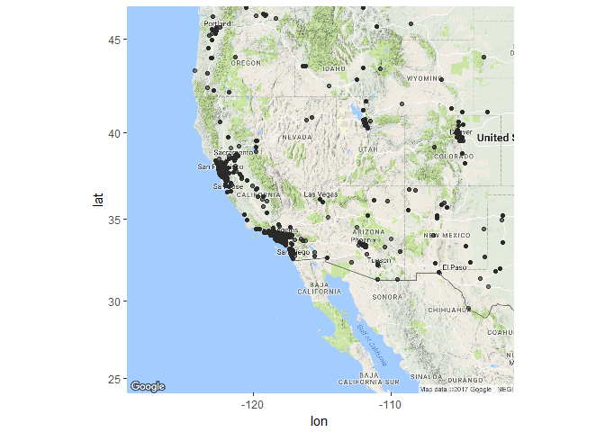

Analysis H1B Visa Petitions Data
================

Analysis of the H1B visa petitions made.
----------------------------------------

PART 1: Basic Analysis.
-----------------------

### We'll start by loading the necessary libraries.

    ## 
    ## Attaching package: 'dplyr'

    ## The following object is masked from 'package:gridExtra':
    ## 
    ##     combine

    ## The following objects are masked from 'package:stats':
    ## 
    ##     filter, lag

    ## The following objects are masked from 'package:base':
    ## 
    ##     intersect, setdiff, setequal, union

### Get input.

``` r
visa <- read_csv("h1b_kaggle.csv")
```

    ## Parsed with column specification:
    ## cols(
    ##   X1 = col_integer(),
    ##   CASE_STATUS = col_character(),
    ##   EMPLOYER_NAME = col_character(),
    ##   SOC_NAME = col_character(),
    ##   JOB_TITLE = col_character(),
    ##   FULL_TIME_POSITION = col_character(),
    ##   PREVAILING_WAGE = col_double(),
    ##   YEAR = col_integer(),
    ##   WORKSITE = col_character(),
    ##   lon = col_double(),
    ##   lat = col_double()
    ## )

``` r
visa <- data.frame(visa)
```

### Changing some data types and removing the first ID column

### Again looking at the summary

``` r
summary(visa)
```

    ##               CASE_STATUS      EMPLOYER_NAME        SOC_NAME        
    ##  CERTIFIED          :2615623   Length:3002458     Length:3002458    
    ##  CERTIFIED-WITHDRAWN: 202659   Class :character   Class :character  
    ##  DENIED             :  94346   Mode  :character   Mode  :character  
    ##  WITHDRAWN          :  89799                                        
    ##  PENDING            :     15                                        
    ##  (Other)            :      3                                        
    ##  NA's               :     13                                        
    ##   JOB_TITLE         FULL_TIME_POSITION PREVAILING_WAGE       YEAR       
    ##  Length:3002458     N   : 426332       Min.   :0.000e+00   2011:358767  
    ##  Class :character   Y   :2576111       1st Qu.:5.437e+04   2012:415607  
    ##  Mode  :character   NA's:     15       Median :6.502e+04   2013:442114  
    ##                                        Mean   :1.470e+05   2014:519427  
    ##                                        3rd Qu.:8.143e+04   2015:618727  
    ##                                        Max.   :6.998e+09   2016:647803  
    ##                                        NA's   :85          NA's:    13  
    ##    WORKSITE              lon               lat        
    ##  Length:3002458     Min.   :-157.86   Min.   :13.44   
    ##  Class :character   1st Qu.:-111.93   1st Qu.:34.17   
    ##  Mode  :character   Median : -86.16   Median :39.10   
    ##                     Mean   : -92.13   Mean   :38.16   
    ##                     3rd Qu.: -75.51   3rd Qu.:40.88   
    ##                     Max.   : 145.73   Max.   :64.84   
    ##                     NA's   :107242    NA's   :107242

### Looks better ! Now the analysis part. We'll go feature by feature.

### The first feature is Case\_Status. It is the status associated with the petition.

``` r
# set colors
mycolors <- c("#FF7F11","#058C42","#FF3F00","#5D2E8C","#590925","#581908","#B80C09",
              "#276FBF","#337357","#B6D7B9","#8338EC","#0F4C5C","#FB8B24","#E16036",
              "#420039","#7A8B99","#8DB580","#00B295","#502419","#BB7E5D")

case.status <- as.data.frame(visa %>% filter(!is.na(CASE_STATUS)) %>% group_by(CASE_STATUS) %>%
                        summarise(PROPORTION = round(n()*100/nrow(visa),1)))

ggplot(data = case.status, aes(x = reorder(CASE_STATUS, PROPORTION), 
                               y = PROPORTION, fill = CASE_STATUS)) + 
    geom_bar(stat = "identity") +
    geom_text(aes(label = paste(PROPORTION,"%")), hjust = 1) + 
    labs(x = "Case Status", y = "Percent", title = "Status of petitioned applications") + 
    scale_fill_manual(values = mycolors) +
    scale_y_continuous(breaks = seq(0,100,10)) +
    coord_flip()
```

 \#\#\# Good news ! Almost 90% of petitions are certified.

### The next features is EMPLOYER\_NAME. It is the company which submits the application for its employee. Let us look at the top 15 recruiters.

``` r
visa$EMPLOYER_NAME <- factor(visa$EMPLOYER_NAME)
top_employer <- as.data.frame(visa %>% group_by(EMPLOYER_NAME) %>%
                              summarise(count = n(), percent = round(count*100/nrow(visa),1)) %>% 
                              arrange(desc(count))%>% 
                              top_n(15, wt = count))

ggplot(data = top_employer, aes(x = reorder(EMPLOYER_NAME, percent),
                                y = percent, fill = EMPLOYER_NAME)) +
    geom_bar(stat = "identity") +
    geom_text(aes(label = percent), vjust = 1.1, hjust = 1.2) + 
    labs(x = "EMPLOYER_NAME", y = "Petitions Made(in percentage)") + 
    scale_fill_manual(values = mycolors) + 
    theme(legend.position = "none") +
    coord_flip()
```


``` r
visa$EMPLOYER_NAME <- as.character(visa$EMPLOYER_NAME)
```

### The top three companies are Indian.

### Note: In the above graph the cumulative percentage is not 100 because there are a lot of other companies which have not been shown. The graph shows only the first 15 companies.

### The next feature is JOB\_TITLE. Let us look at top 15 Job positions for which petitions are made.

``` r
visa$JOB_TITLE <- factor(visa$JOB_TITLE)
top_employer <- as.data.frame(visa %>% group_by(JOB_TITLE) %>%
                              summarise(count = n(), percent = round(count*100/nrow(visa),1)) %>% 
                              arrange(desc(count))%>% 
                              top_n(15, wt = count))

ggplot(data = top_employer, aes(x = reorder(JOB_TITLE, percent),
                                y = percent, fill = JOB_TITLE)) +
    geom_bar(stat = "identity") +
    geom_text(aes(label = percent), vjust = 1.1, hjust = 1.2) + 
    labs(x = "JOB TITLE", y = "Petitions Made(in percentage)") +
    theme(legend.position = "none") +
    scale_fill_manual(values = mycolors) +
    coord_flip()
```


``` r
visa$JOB_TITLE <- as.character(visa$JOB_TITLE)
```

### "Analyst Programmer" is the most famous job. Moreover, the top 10 jobs as we can see in the graph are purely technical jobs.

### The next feature is FULL\_TIME\_POSITION. It is a categorical feature. "Y" means the job is full time. "N" means it is part time.

``` r
knitr::kable(as.data.frame(prop.table(table(visa$FULL_TIME_POSITION))*100))
```

| Var1 |     Freq|
|:-----|--------:|
| N    |  14.1995|
| Y    |  85.8005|

``` r
ggplot(data = subset(visa, !is.na(visa$FULL_TIME_POSITION)),
        aes(x = FULL_TIME_POSITION, y = (..count..)*100/3002458, fill = FULL_TIME_POSITION)) + 
        geom_bar() +
        labs(y = "Petitions Made(in percentage)") +
        theme(legend.position = "none") +
        scale_y_continuous(breaks = seq(0,100,10))
```


### Around 85% of the total jobs are full time.

### Next up is PREVAILING\_WAGE. Prevailing Wage for the job being requested for temporary labor condition. The wage is listed at annual scale in USD. The prevailing wage for a job position is defined as the average wage paid to similarly employed workers in the requested occupation in the area of intended employment. The prevailing wage is based on the employer's minimum requirements for the position.

``` r
ggplot(data = subset(visa, visa$PREVAILING_WAGE < quantile(visa$PREVAILING_WAGE, 0.99, na.rm = T)),
       aes(x = PREVAILING_WAGE/1000)) +
    geom_histogram(color = "black", fill = mycolors[1], binwidth = 2.5) +
    scale_x_continuous(breaks = seq(0,150,25)) +
    scale_y_continuous(breaks = seq(0,500000,25000)) +
    labs(x = "Salary (in thousand USD)", y = "Number of petitions")
```


### Almost normal looking distribution after removing outliers.

### The next feature is YEAR: Year in which the H-1B visa petition was filed. The data contains petitions from 2011-2016.

``` r
year1 <- ggplot(data = visa %>% filter((!is.na(YEAR)) & 
        (visa$CASE_STATUS == "CERTIFIED-WITHDRAWN" | visa$CASE_STATUS == "WITHDRAWN" |
        visa$CASE_STATUS == "DENIED") ) %>% 
        group_by(YEAR, CASE_STATUS) %>% summarise(count = n()),
        aes(x = as.numeric(as.character(YEAR)), y = count/1000)) + 
        geom_line(linejoin = "round", lineend = "round", aes(color = CASE_STATUS)) +
        geom_point() +
        coord_cartesian(ylim = c(0,50)) +
        scale_color_manual(values = c("#59C3C3", "#FC0402","#FFC145")) +
        scale_y_continuous(breaks = seq(0,50, 5)) +
        labs(title = "Petition and Case Status trend with time", x = "YEAR",
        y = "Number of petitions(in thousands)")

year2 <- ggplot(data = visa %>% filter((!is.na(YEAR)) &
         (visa$CASE_STATUS == "CERTIFIED")) %>%
         group_by(YEAR, CASE_STATUS) %>% summarise(count = n()),
         aes(x = as.numeric(as.character(YEAR)), y = count/1000)) +
         geom_line(linejoin = "round", lineend = "round", aes(color = CASE_STATUS)) +
         geom_point() +
         coord_cartesian(ylim = c(300,600)) +
         scale_color_manual(values = c("#43B21E")) +
         scale_y_continuous(breaks = seq(0,650, 50)) +
         labs(title = "Petition and Case Status trend with time", x = "YEAR",
         y = "Number of petitions(in thousands)")

grid.arrange(year2,year1, nrow = 2)
```


### More good news! Everything except the DENIED petitions seem to be increasing with every passing year.

### Let's check how the JOB\_TYPE has changed ovver the years.

``` r
ggplot(data = visa %>% group_by(YEAR, FULL_TIME_POSITION) %>%
        summarise(count = n()) %>% filter(!is.na(YEAR) & !is.na(FULL_TIME_POSITION)),
        aes(x = as.numeric(as.character(YEAR)), y = count/1000, color = FULL_TIME_POSITION)) + 
        geom_line(na.rm = T) + geom_point(na.rm = T) +
        scale_y_continuous(breaks = seq(0,650,40)) +
        labs(x = "YEAR", y = "Number of Petitions",
        title = "Petition trend and Job Type over the years")
```


### Looks like there is a sudden increase in number of part time jobs in 2016. In fact there are more petitions for part time jobs than full time jobs for that year. Any guesses why ??

### Let's check the most popular cities to work.

``` r
visa$WORKSITE <- factor(visa$WORKSITE)
top_employer <- as.data.frame(visa %>% group_by(WORKSITE) %>%
                summarise(count = n(), percent = round(count*100/nrow(visa),1)) %>% 
                arrange(desc(count))%>% 
                top_n(15, wt = count))

ggplot(data = top_employer, aes(x = reorder(WORKSITE, percent),
                                y = percent, fill = WORKSITE)) +
    geom_bar(stat = "identity") +
    geom_text(aes(label = percent), vjust = 1.1, hjust = 1.2) + 
    labs(x = "WORKSITE", y = "Petitions made(in percentage)") + 
    scale_y_continuous(breaks = seq(0,7,1)) +
    scale_fill_manual(values = mycolors) +
    theme(legend.position = "none") +
    coord_flip()
```


``` r
visa$WORKSITE <- as.character(visa$WORKSITE)
```

### Looks like New York City is the most preferred work place for the employees.

### Let us take a look at the most denied and most accepted jobs.

``` r
denied_jobs <- visa %>% filter(CASE_STATUS == "DENIED") %>%
    group_by(JOB_TITLE) %>% summarise(JOBS_DENIED_COUNT = n()) %>%
    arrange(desc(JOBS_DENIED_COUNT)) %>% top_n(7)
```

    ## Selecting by JOBS_DENIED_COUNT

``` r
knitr::kable(denied_jobs)
```

| JOB\_TITLE              |  JOBS\_DENIED\_COUNT|
|:------------------------|--------------------:|
| PROGRAMMER ANALYST      |                 3583|
| SOFTWARE ENGINEER       |                 2325|
| ACCOUNTANT              |                 1823|
| COMPUTER PROGRAMMER     |                 1381|
| MARKET RESEARCH ANALYST |                 1050|
| SOFTWARE DEVELOPER      |                  974|
| SYSTEMS ANALYST         |                  908|

``` r
accepted_jobs <- visa %>% filter(CASE_STATUS == "CERTIFIED") %>%
    group_by(JOB_TITLE) %>% summarise(JOBS_CERTIFIED_COUNT = n()) %>%
    arrange(desc(JOBS_CERTIFIED_COUNT)) %>% top_n(7)
```

    ## Selecting by JOBS_CERTIFIED_COUNT

``` r
knitr::kable(accepted_jobs)
```

| JOB\_TITLE               |  JOBS\_CERTIFIED\_COUNT|
|:-------------------------|-----------------------:|
| PROGRAMMER ANALYST       |                  222730|
| SOFTWARE ENGINEER        |                  102990|
| COMPUTER PROGRAMMER      |                   64018|
| SYSTEMS ANALYST          |                   55744|
| SOFTWARE DEVELOPER       |                   37771|
| BUSINESS ANALYST         |                   35204|
| COMPUTER SYSTEMS ANALYST |                   31433|

### Results for both are almost same. Accountant job petition seems to be rejected quite often.

Let us visualize the petitions made on the map of USA.
------------------------------------------------------

``` r
visa_sub <- subset(visa, !is.na(visa$lon & !is.na(visa$lat)))

# east usa
east_usa <- get_map(location="Kentucky, United States", zoom = 5, maptype = "terrain",
                    source="google", color="color")
```

    ## Map from URL : http://maps.googleapis.com/maps/api/staticmap?center=Kentucky,+United+States&zoom=5&size=640x640&scale=2&maptype=terrain&language=en-EN&sensor=false

    ## Information from URL : http://maps.googleapis.com/maps/api/geocode/json?address=Kentucky,%20United%20States&sensor=false

``` r
ggmap(east_usa) + geom_point(alpha = 0.01, data = visa_sub,
                             aes(x = lon, y = lat))
```


``` r
# west usa
west_usa <- get_map(location="Las Vegas, NV, USA", zoom = 5, maptype = "terrain",
                    source="google", color="color")
```

    ## Map from URL : http://maps.googleapis.com/maps/api/staticmap?center=Las+Vegas,+NV,+USA&zoom=5&size=640x640&scale=2&maptype=terrain&language=en-EN&sensor=false

    ## Information from URL : http://maps.googleapis.com/maps/api/geocode/json?address=Las%20Vegas,%20NV,%20USA&sensor=false

``` r
ggmap(west_usa) + geom_point(alpha = 0.01, data = visa_sub,
                             aes(x = lon, y = lat))
```


